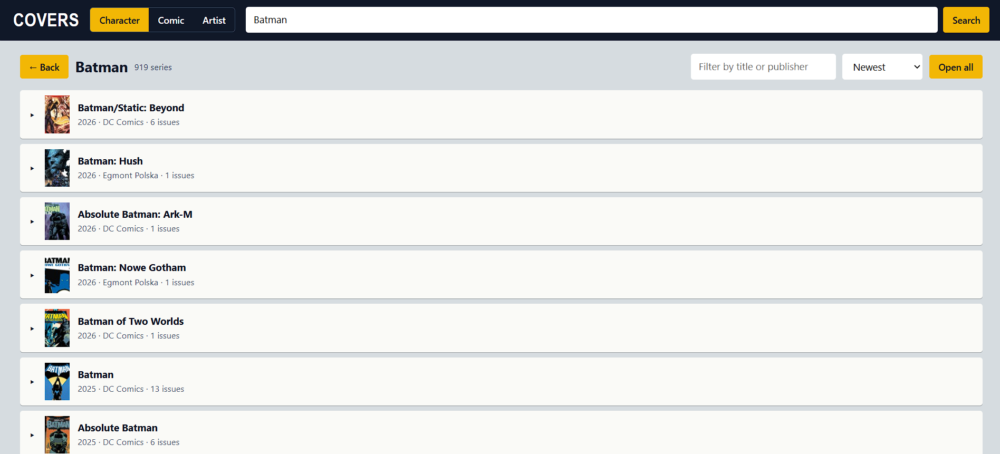

# 🦇 Comic Cover Browser

A local web app to **browse every cover of a character, series or artist on a single page**, including **variant covers**, and download them at the highest resolution available. Built for finding covers to turn into posters.

It uses the [Comic Vine API](https://comicvine.gamespot.com/api/) and runs on your own computer. All you need is Python, with no extra libraries.

## Features



- **Three ways to search:** by **character** (Batman), by **comic** (Absolute Batman) or by **artist** (Peach Momoko, John Romita Jr.).
- **Everything on one page:** each series is a collapsible section. Open it and its covers load right there, with no page changes.
- **Variant covers:** one button per series loads the alternate covers next to each issue, marked with a tag.
- **Merged series:** series with the same name and start year (for example the US edition and other editions) are combined into a single section.
- **Filter and sort:** filter by title or publisher, and sort by newest, most issues or A-Z.
- **Full-size viewer:** click any cover to see it large, with its pixel dimensions and the largest poster size it supports at 150 dpi.
- **Artist covers only:** in Artist mode, a button per series keeps only the issues where Comic Vine credits the artist with a cover.
- **High-quality downloads:** the **Download** button saves the original image from Comic Vine, not the thumbnail shown on screen.

## Getting started

### 1. Requirements

- [Python 3.8 or later](https://www.python.org/downloads/). No libraries to install.
- A free Comic Vine API key: create an account at [comicvine.gamespot.com](https://comicvine.gamespot.com) and copy your key from [comicvine.gamespot.com/api](https://comicvine.gamespot.com/api/).

### 2. Run it

Download this repository, open a terminal in its folder and run:

```bash
python comic_covers.py
```

On Mac or Linux you may need `python3 comic_covers.py`. On Windows, if `python` doesn't work, try `py comic_covers.py`.

The first time, it asks for your key and saves it to `comicvine_key.txt`, so you only paste it once. You can also provide it through the `COMICVINE_API_KEY` environment variable.

Your browser opens at `http://127.0.0.1:8765`. Press `Ctrl+C` in the terminal to stop it.

### 3. Find covers

1. Choose **Character**, **Comic** or **Artist** next to the search box.
2. Type a name and press **Search**. For characters and artists, pick the right person from the results.
3. Open the series you're interested in. **Open all** expands every visible series.
4. Press **Load variants** inside a series to add its alternate covers.
5. Press **Download** on any cover you like.

## Limitations

- **Rate limit.** Comic Vine limits requests per hour (around 200 per resource). Loading variants makes one request per issue, and opening many series at once uses a lot. If you hit the limit, the page tells you and you can press the button again later; it resumes where it left off.
- **A character's series list is incomplete.** Comic Vine's per-character list of series is sparsely filled in. So character search combines that list with every series whose title contains the name (up to 1000). Series where the character appears but isn't in the title (for example *Detective Comics* for Batman) only show up if Comic Vine has them linked.
- **Artists:** you get the series where the artist has credits. Use **Only artist's covers** to keep just the issues where they are credited with a cover. This checks every issue's credits (one request each), so it counts against the rate limit, and it only works where Comic Vine has cover credits filled in.
- **Popularity:** Comic Vine has no sales or popularity data. "Most issues" is the closest option.
- **Quality:** downloads are the largest image Comic Vine has, and its size depends on what each user uploaded. Large posters may need an AI upscaler.
- **Data:** Comic Vine is crowd-sourced, so recent releases may be missing or late.

## Troubleshooting

| Problem | Fix |
| --- | --- |
| Invalid API key error | Delete `comicvine_key.txt` and run the script again to paste your key. |
| "Rate limit reached" | Wait a while. Anything already loaded stays available while the program is running. |
| Port 8765 is already in use | Change the `PORT` value at the top of `comic_covers.py`. |
| The browser doesn't open | Open `http://127.0.0.1:8765` manually. |

## Privacy

The program only listens on your own computer (`127.0.0.1`). Your key is stored in `comicvine_key.txt`, which this repository's `.gitignore` excludes so it isn't uploaded to GitHub by mistake. Never share that file.

## Disclaimer

Unofficial project, not affiliated with Comic Vine, Fandom or any publisher. Covers belong to their publishers and artists; this tool is intended for browsing and personal use. Check the [Comic Vine API terms of use](https://comicvine.gamespot.com/api/) before using it in any other way.
